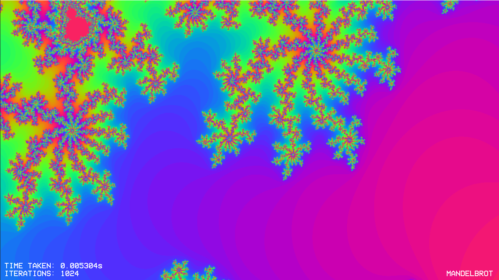

# Mandelbrot

This project uses [SFML (64-bit) with Visual Studio](https://www.sfml-dev.org/tutorials/2.5/start-vc.php "SFML"). To compile using Visual Studio, create an environment variable called **SFML64_SDK** that points to your SFML library install location.

Alternatively, you can simply run the **mandelbrot.exe** file included in this repository.

| Key | Action  |
| ------------ | ------------ |
|  Q | Zoom in |
|  A | Zoom out |
|  Up Arrow | Increase iterations |
|  Down Arrow | Decrease iterations |
|  Mouse Right Button Held | Use mouse to pan around |
|  Mouse  | Control the zoom direction by moving the mouse while zooming |
|  ESC | Exit application |

*Alan B, 2021*